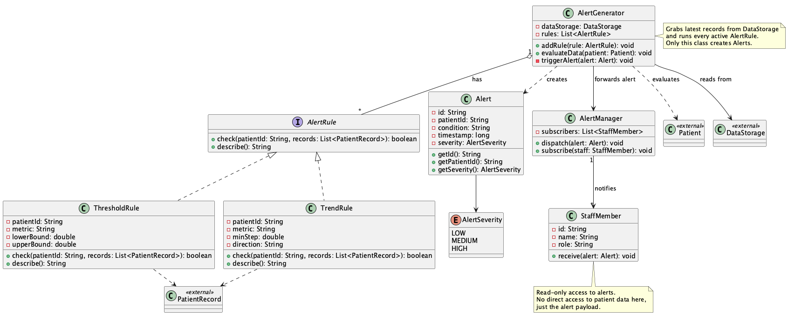
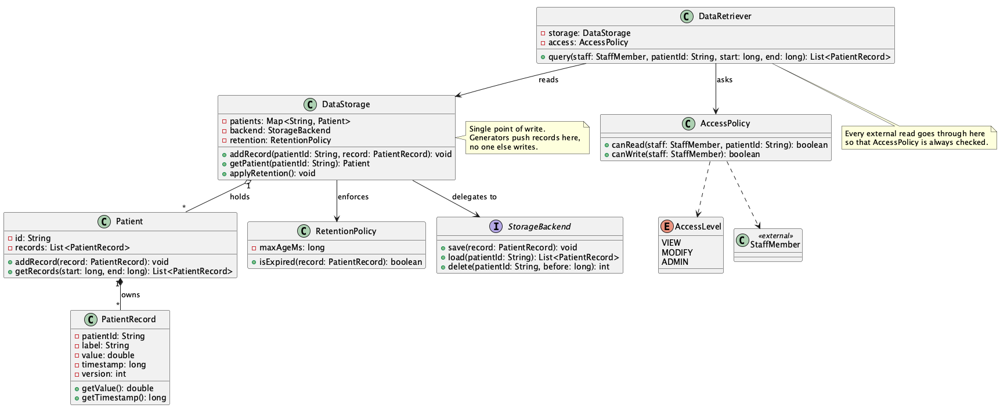
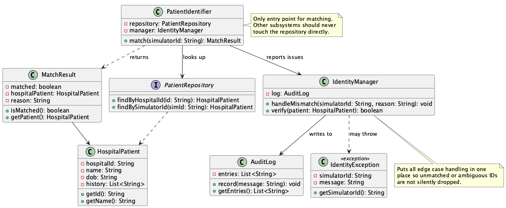
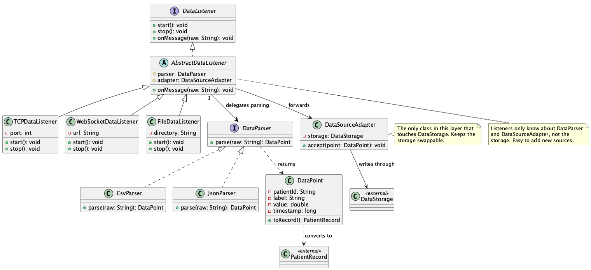

# UML Class Diagrams

Class diagrams for the four CHMS subsystems.

## Diagrams

1. 
2. 
3. 
4. 

---

## 1. Alert Generation System

The alert subsystem is built around `AlertGenerator`, which keeps a list of `AlertRule` objects. `AlertRule` is an interface so that new alert types can be added without changing the generator. The two concrete rules in the diagram are `ThresholdRule` (e.g. systolic BP above 180) and `TrendRule` (three rising readings). Together they already cover most of the alert specs from the project description, and other rules can be plugged in the same way.

When `evaluateData(patient)` runs, the generator grabs the patient's recent records from `DataStorage`, asks each rule whether the situation matches, and builds an `Alert` if it does. The alert holds a patient ID, a description, a timestamp and a severity level (`AlertSeverity` enum). Alerts are then handed to `AlertManager`, which keeps a list of subscribed `StaffMember`s and sends the alert to each of them. Splitting "decide" (generator) from "notify" (manager) means we can change the way alerts are sent later (email, pager, dashboard) without touching the rule logic.

For access, only `AlertGenerator` writes alerts. Staff members only receive them and do not get to see the underlying records through this subsystem, just the alert payload. `Patient`, `DataStorage` and `PatientRecord` are marked as external because they belong to other subsystems and are only here for the relationships.

---

## 2. Data Storage System

`DataStorage` is the single point of write in the system. It owns a map of `Patient` objects, each of which is a composition of `PatientRecord` (when a patient is removed, all their records are removed with them). Records carry a label, a value, a timestamp and a version number, which lets us keep older readings around instead of overwriting them.

Reads and writes go through different paths on purpose. Generators add records by calling `addRecord` on `DataStorage` directly. Anyone who wants to read has to go through `DataRetriever`. `DataRetriever` asks `AccessPolicy` before returning anything, which is where the role checks live (a nurse may see vitals for their ward, an admin sees everything). That way the storage class itself stays free of permission logic.

`StorageBackend` is an interface so the actual storage can be in memory now and swapped for a database later without touching the rest of the system. `RetentionPolicy` decides when a record is too old to keep, and `applyRetention` is meant to run on a schedule to clean things up.

Access rules: only generators write through `DataStorage`. All reads from outside the subsystem must go through `DataRetriever`. `AccessLevel` is an enum (`VIEW`, `MODIFY`, `ADMIN`) used by `AccessPolicy`. `StaffMember` is referenced as external because it belongs to another part of the system.

---

## 3. Patient Identification System

This subsystem turns a simulator-side patient ID into the actual hospital record. `PatientIdentifier` is the only entry point. It calls `PatientRepository` (an interface, so the real hospital DB or a test stub can be plugged in) and returns a `MatchResult`. The wrapper is there instead of returning `HospitalPatient` directly so the caller can also see why a match failed without having to catch an exception for the normal "not found" case.

When something goes wrong (no match, more than one match, suspicious ID format) the identifier hands the case off to `IdentityManager`, which puts all the edge case handling in one place. The manager writes to `AuditLog` so anomalies are recorded, and can throw `IdentityException` if it cannot recover. Keeping all this in one class stops the rest of the system from silently dropping unmatched data.

`HospitalPatient` holds the sensitive fields (name, date of birth, history). Because of privacy, no other subsystem stores or passes these around. The alert system only knows the patient ID, the storage system only knows record values. The identification subsystem is the only place where hospital-level details exist.

Access rules: only `PatientIdentifier` is exposed outside the subsystem. `PatientRepository` is internal and is not reached from elsewhere. `AuditLog` can be read by outside observers (such as monitoring), but only `IdentityManager` is allowed to write to it.

---

## 4. Data Access Layer

This subsystem turns whatever the simulator sends (over TCP, WebSocket or as a file) into clean `DataPoint` objects the rest of the system can consume. The strategy pattern shows up in two places: one for the input transport (`DataListener` and its subclasses), one for the wire format (`DataParser` and its subclasses).

`DataListener` is the interface, with `TCPDataListener`, `WebSocketDataListener` and `FileDataListener` as the concrete listeners. `AbstractDataListener` holds the shared fields (`parser`, `adapter`) so subclasses only have to implement `start` and `stop`. Each listener gets a `DataParser` (CSV or JSON) passed in so the same listener can handle different formats. `DataPoint` is the parsed representation, and it has a `toRecord()` helper that converts it to the storage-side `PatientRecord`.

`DataSourceAdapter` is the only class in this layer that knows about `DataStorage`. Listeners hand parsed points to the adapter, and the adapter writes them through. That extra step keeps storage swappable and keeps each listener small.

Access rules: classes outside the subsystem talk to `DataSourceAdapter` only, never directly to a listener or parser. A new transport or format can be added by creating a new subclass without touching anything else. Errors during parsing are caught inside the listeners, so one bad message does not bring the simulation down.
